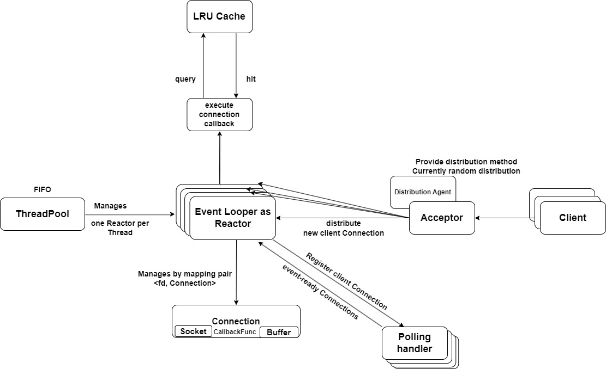
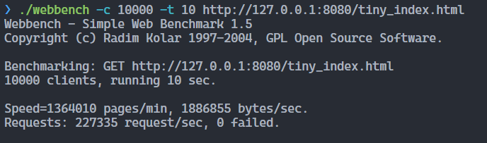
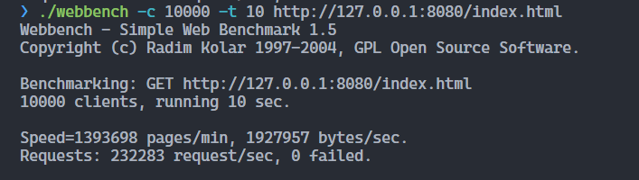

<h1> http-server <h1>

## **Table of Contents**
- [**Table of Contents**](#table-of-contents)
- [1. **Features**](#1-features)
  - [1.1. **Design Decision**](#11-design-decision)
  - [1.2. **Development Decision**](#12-development-decision)
- [2. **Server Design**](#2-server-design)
- [3. **Building Project**](#3-building-project)
- [4. **Benchmark**](#4-benchmark)
  - [4.1. **Environment**](#41-environment)
  - [4.2. **Result**](#42-result)
- [5. **About Limitations**](#5-about-limitations)
  - [5.1. **Missing features**](#51-missing-features)
  - [5.2. **Code improvements**](#52-code-improvements)

## 1. **Features**

### 1.1. **Design Decision**
- Set non-blocking socket and edge-trigger handling mode based on [C10K problem](http://www.kegel.com/c10k.html)
- Implemented the Reactor pattern with thread pool management: **Reactor per thread**.
- Support HTTP/1.1 GET/HEAD request & response.
- Support dynamic CGI request & response.
- Implemented Caching (LRU for now) reduce server load and increase responsiveness.
- Implemented asynchronous consumer-producer logging.
- Unit testing supported.
### 1.2. **Development Decision**
- **Environment**: Linux
- **Compiler**:
  - LLVM/Clang 16
  - GNU/GCC 11.3
- **C++ Standard**: 20
- **Coding Convention**:
  - [C++ Core Guidelines](https://isocpp.github.io/CppCoreGuidelines/)
  - [Chromium Style Guide](https://chromium.googlesource.com/chromium/src/+/main/styleguide/c++/c++.md)
  - Following Static Analysis warnings by `clang-tidy`, `clangd` and `Clang Static Analyzer`
- **Build System**: CMake and Ninja
- **Benchmark**: use [webbench](/benchmark/webbench/)
- **Third parties** (managed by [vcpkg](https://github.com/microsoft/vcpkg)):
  - Followed [C++ Core Guidelines](https://isocpp.github.io/CppCoreGuidelines/) with [Microsoft.GSL](https://github.com/microsoft/GSL)
  - Tested with [Catch2](https://github.com/catchorg/Catch2)
  - String formatting with [fmtlib](https://github.com/fmtlib/fmt)
  - Command-line parsing with [cxxopts](https://github.com/jarro2783/cxxopts)
  - Use [Chromium's `base::NoDestructor`](/src/third_party/chromium/base/no_destructor.h) for wrapping function-local static variables.

## 2. **Server Design**



The above system architecture diagram briefly shows how the my project works in general:

1. A **Connection** contains a **Socket** and a **Buffer** for bytes in-and-out. Users register a **callback** function for each connection.
2. The system starts with an **Acceptor**, which contains one acceptor connection. It builds connection for each new client, and distribute the workload to one of the **Looper**s.
3. Each **Poller** is associated with exactly one **Looper**. It does nothing but epoll, and returns a collection of event-ready connections back to the **Looper**.
4. The **Looper** is the main brain of the system. It registers new client connection into the **Poller**, and upon the **Poller** returns back event-ready connections, it fetches their callback functions and execute them.
5. The **ThreadPool** manages how many **Looper**s are there in the system to avoid over-subscription.
6. Optionally there exists a **Cache** layer using LRU policy with tunable storage size parameters.

## 3. **Building Project**

Make sure you have installed:
- CMake (>= 3.23)
- [Ninja](https://ninja-build.org/) (optional)
- [vcpkg](https://github.com/microsoft/vcpkg)

Build the project with CMake and Ninja:
```bash
# create a build environment
mkdir build
cd build

# Configure project and install third parties at `build` folder
cmake -DCMAKE_BUILD_TYPE=Release \
      -DCMAKE_TOOLCHAIN_FILE=path/to/vcpkg/scripts/buildsystems/vcpkg.cmake \
      -G Ninja \
      ..


# Build the project
cmake --build . --config Release

# Run the executable, use --help for options
# Provide your resources path, it should contains a index.html file
# See demo/http-server/pages for example
./demo/http-server/http-server --directory ./demo/http-server/pages/

# Run test
# There are several tests which relies on threads.
# Therefore, we need to run manually:
# build/test/xxx_test instead of the below command
ctest -C Release -V
```

## 4. **Benchmark**

I adopt [Webbench](http://cs.uccs.edu/~cs526/webbench/webbench.htm) as the stress testing tool. This tool is stored under [benchmark/webbench](/benchmark/webbench/).

```bash
# running the server first
# pwd is project location
# default address is http://127.0.0.1:8080
./build/demo/http-server/http_server --directory ./build/demo/http-server/pages

# in another console host
# Run 10000 clients in 10s
./benchmark/webbench/webbench -c 10000 -t 10 https://127.0.0.1:8080
```

### 4.1. **Environment**
- OS: Ubuntu 20.04
- Intel® Xeon® Processor E3-1505M v5 (8 CPUs) ~ 2.8GHz
- Memory: 16GB
- Benchmark cases:
  - Using 2 `index.html` in [demo/http-server/pages](/demo/http-server/pages/):
    - `tiny_index.html`: 1KB
    - `index.html`: 10MB
  - Cache set to 100MB

### 4.2. **Result**
- `tiny_index.html`

- `index.html`


## 5. **About Limitations**
Due to the deadline, I cannot implement the following things:
### 5.1. **Missing features**
- Multipart data
- Load balancing
- Proactor pattern
- Full HTTP/1.1 support<br>
I have focused on the C10K solution. So there are only HEAD/GET implementation.
- Database support<br>
The performance improvement from **Cache** might not seem significant for me, due to I only implemented a really naive **LRU Cache**. I believe when database comes into play, the usage of the **Cache** layer will be more obvious.
### 5.2. **Code improvements**
- Build configuration for different options for benchmark-friendly purpose<br>
Currently, due to time restriction, I cannot provide a proper build configuration. For example, toggle switch for turning on/off Cache.
- Over-used of `mutex`. <br>
Due to time limtation, I cannot implement a more elegant design and reduce the overhead of **C++ STL threading library**
- Over-use of `fcntl` system calls.
- Exception handling and thread safety.

These limitations have been already commented as `TODO(longlp)` in the source codes.
