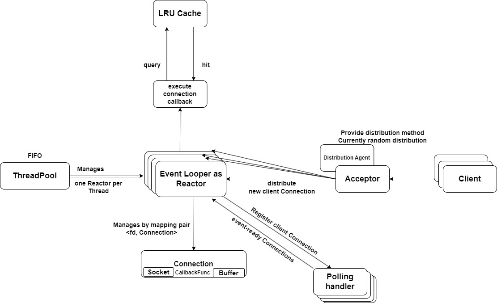

# http-server

## Features

### **Design Decision**
- Set non-blocking socket and edge-trigger handling mode based on [C10K problem](http://www.kegel.com/c10k.html)
- Implemented the Reactor pattern with thread pool management: **Reactor per thread**.
- Support HTTP/1.1 GET/HEAD request & response.
- Support dynamic CGI request & response.
- Implemented Caching (LRU for now).
- Implemented asynchronous consumer-producer logging.
### **Development Decision**
- **Environment**: Linux
- **Compiler**:
  - LLVM/Clang 16
  - GNU/GCC 11.3
- **C++ Standard**: 20
- **Coding Convention**:
  - [C++ Core Guidelines](https://isocpp.github.io/CppCoreGuidelines/)
  - [Chromium Style Guide](https://chromium.googlesource.com/chromium/src/+/main/styleguide/c++/c++.md)
  - Following Static Analysis warnings by `clang-tidy`, `clangd` and `Clang Static Analyzer`
- **Build System**: CMake and Ninja
- **Benchmark**: use [webbench](/benchmark/webbench/)
- **Third parties** (managed by [vcpkg](https://github.com/microsoft/vcpkg)):
  - Followed [C++ Core Guidelines](https://isocpp.github.io/CppCoreGuidelines/) with [Microsoft.GSL](https://github.com/microsoft/GSL)
  - Tested with [Catch2](https://github.com/catchorg/Catch2)
  - String formatting with [fmtlib](https://github.com/fmtlib/fmt)
  - Command-line parsing with [cxxopts](https://github.com/jarro2783/cxxopts)
  - Use [Chromium's `base::NoDestructor`](/src/third_party/chromium/base/no_destructor.h) for wrapping function-local static variables.

## **Server Design**



The above system architecture diagram briefly shows how the my project works in general:

1. A **Connection** contains a **Socket** and a **Buffer** for bytes in-and-out. Users register a **callback** function for each connection.
2. The system starts with an **Acceptor**, which contains one acceptor connection. It builds connection for each new client, and distribute the workload to one of the **Looper**s.
3. Each **Poller** is associated with exactly one **Looper**. It does nothing but epoll, and returns a collection of event-ready connections back to the **Looper**.
4. The **Looper** is the main brain of the system. It registers new client connection into the **Poller**, and upon the **Poller** returns back event-ready connections, it fetches their callback functions and execute them.
5. The **ThreadPool** manages how many **Looper**s are there in the system to avoid over-subscription.
6. Optionally there exists a **Cache** layer using LRU policy with tunable storage size parameters.

## **Building Project**

Make sure you have installed:
- CMake (>= 3.23)
- [Ninja](https://ninja-build.org/) (optional)
- [vcpkg](https://github.com/microsoft/vcpkg)

Build the project with CMake and Ninja:
```bash
# create a build environment
mkdir build
cd build

# Configure project and install third parties at `build` folder
cmake -DCMAKE_BUILD_TYPE=Release \
      -DCMAKE_TOOLCHAIN_FILE=path/to/vcpkg/scripts/buildsystems/vcpkg.cmake \
      -G Ninja \
      ..


# Build the project
cmake --build . --config Release

# Run the executable, use --help for options
# Provide your resources path, it should contains a index.html file
# See demo/http-server/pages for example
./demo/http-server/http-server --directory ./demo/http-server/pages/

# Run test
# There are several tests which relies on threads.
# Therefore, we need to run in manually:
# build/test/xxx_test instead of the below command
ctest -C Release -V
```

## **Benchmark**

I adopt [Webbench](http://cs.uccs.edu/~cs526/webbench/webbench.htm) as the stress testing tool. This tool is stored under [benchmark/webbench](/benchmark/webbench/).

```bash
# running the server first
# pwd is project location
./build/demo/http-server/http_server --directory ./build/demo/http-server/pages

# in another console host
# Run 10000 clients in 10s
./benchmark/webbench/webbench -c 10000 -t 10
```

We performed benchmark testing on an Amazon AWS EC2 instance. The details are as follows:

+ **Hardware**: m5.2xlarge instance on **Ubuntu 20.04 LTS** with **8** vCPUs, **32** GiB memory, **50** GiB root storage volume. (Be careful that vCPU is not real CPU core, by experiment `std::hardware_concurrency() = 2` in this case)
+ **QPS**: **62.3**k (no cache) | **62.8**k (with cache)

The performance improvement from **Cache** might not seem significant. Partly because disk I/O is getting faster nowadays, the cost of loading a small `index.html` might be smaller than the mutual exclusive operations in the **Cache**.

When database connector comes into play, the indispensability of the **Cache** layer will be more obvious.


### Future Work
This repo is under active development and maintainence. New features and fixes are updated periodically as time and skill permit.

The followings are on the **TODO** list:

- ✅ Support serving HTTP GET/HEAD Request & Response
- ✅ Revise according to this [code review](https://codereview.stackexchange.com/questions/282220/tiny-network-web-framework-library-in-c) suggestions
- ✅ Refactor the architecture into multiple Reactor mode to improve concurrency
- ✅ Add performance testing benchmark
- ✅ Add a Cache layer to reduce server load and increase responsiveness
- ✅ Enable dynamic CGI request support
- ✅ Support MacOS build compatability by kqueue
- ✅ Complete unit testing coverage
- ✅ Benchmark with other leading libraries
- [ ] Profile Turtle's main runtime bottleneck
- [ ] Review suggestions on [reddit](https://www.reddit.com/r/cpp/comments/10vrv4i/seeking_improve_advice_on_my_c_network_library/) are listed on issues to contemplate and experiment
- ✅ Support asynchronous logging mechanism
- [ ] Support timing each client connection and kills inactive ones
- ✅ Support Database connection

We also welcome new feature request. We will review them one by one, and priortize its implementation if applicable. Or direct pull request is also welcomed.
